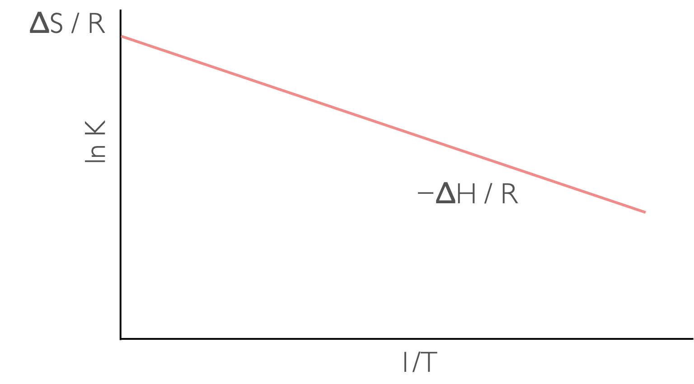

```{r setup, include=FALSE}
knitr::opts_chunk$set(echo = FALSE)
```

## CH3/40220 Chemical Thermodynamics in Context

Dr Fiona Dickinson

fd287@bath.ac.uk

[Message me on Teams](https://teams.microsoft.com/l/chat/0/0?users=%3Cfd287@bath.ac.uk%3E)

## About these notes

I'm writing my slides in a web package so that they are accessible to students who use screen readers. Unlike other notes these slides are only available as .html files, but you can print them to pdf from your web browsers.

If you spot any typos or places where it makes no sense please do let me know, however these are not 'stand alone' slides and are just a backbone for my lecture slots.

## Course Structure

This is the first time I've run this course and to a certain extent I am writing it as I go along, so some timings of content may shift.

As such any past papers for this unit are not on the current content. I will make an example paper available as we near the end of the course.

The unit is assessed 100% by exam.

## Course Timetable

- Week 1: <span style="color:crimson">In Person - Intro to the course, refresher course on thermodynamics</span>
- Week 2: <span style="color:darkturquoise">LOIL - Lecture - Crown & lariat ethers and related molecules</span>
- Week 3: In Person - Workshop (research paper based exercise)
- Week 4: <span style="color:darkturquoise">LOIL - Lecture - Self assembly the basics, DNA duplexing and beyond</span>
- Week 5: In Person - Workshop (research paper based exercise) 
- Week 6: <span style="color:darkturquoise">LOIL - Lecture - Tertiary structures</span>
- Week 7: In Person - Workshop (research paper based exercise)
- Week 8: <span style="color:darkturquoise">LOIL - Lecture - Binding of small molecules to biopolymers</span>
- Week 9: In Person - Workshop (research paper based exercise)
- Week 10: <span style="color:darkturquoise">LOIL - Lecture - Solvation, hydrodynamics & osmosis</span>
- Week 11: In Person - Workshop example exam questions

## Revision of fundamentals of thermodynamics

[My first year thermodynamics course.](https://chemfd.github.io/CH10137/)

Entropy, $(\Delta) S$

Internal energy $(\Delta)U$

Enthalpy, $(\Delta) H$

Gibbs' free energy $(\Delta) G$ (constant pressure systems)

Helmholtz' free energy $(\Delta) A$ (constant volume systems)

Most things we care about in thermodynamics are <span style="color:crimson">state functions </span>.

## Gibbs' free energy

The entropy of the surroundings in a closed system is related to the enthalpy of the system, such that:

<p align="center">
$\Delta S_{\textrm{sur}} = -\frac{\Delta H_\textrm{sys}}{T}$
</p>

Gibb's then restated the second law of thermodynamics into a single equation considering the system and surroundings:

<p align="center">
$\Delta G = \Delta H - T \Delta S$
</p>

## Helmholtz' free energy

There is of course a constant volume equivalent that works in the same way, the Helmholtz free energy:

<p align="center">
$\Delta S_{\textrm{sur}} = -\frac{\Delta U_\textrm{sys}}{T}$
</p>

<p align="center">
$\Delta A = \Delta U - T \Delta S$
</p>

## Spontenaity

Table: The spontaneity of a reaction at different temperatures.

|$\Delta H$ | $\Delta S$ | $\Delta G$ | Spontaneity |
|:----:|:----:|:----:|:----:|
| + <br> endothermic | + | + at low T <br> − at high T | spontaneous at high temperature |
| + <br> endothermic | − | + | needs work to occur |
| − <br> exothermic | + | − | always spontaneous |
| − <br> exothermic | − | − at low T <br> + at high T | spontaneous at low temperature |

## Spontanaity 

```{r echo=FALSE, Gibbstemp, out.width='80%', fig.show='hold', fig.align='center', fig.cap='The temperature dependence of Gibbs free energy for different reaction types: endothermic and increase in entropy (top left), endothermic with a decrease in entropy (top right), exothermic with an increase in entropy (bottom left) and exothermix with a decrease in entropy (bottom right).'}
knitr::include_graphics("images/Gibbstemp.png")
```


## Equilibrium

For the equilibrium:

<p align="center">
$A+B \leftrightharpoons AB$
</p>

Then the equilibrium constant K is given by:

<p align="center">
$K = \frac{[AB]}{[A][B]}$*
</p>

<sub>*(assuming the solution is 'ideal' or the concentration can be used as an approximation for the activity)</sub>

Van't Hoff linked this 'driving force' of the reaction to the equilibrium constant, K.

<p align="center">
$\Delta H - T\Delta S = -RT \ln K$
</p>

## Temperature dependence of equilibrium

<p align="center">
$\ln K= -\frac{\Delta H}{R}\frac{1}{T} + \frac{\Delta S}{R}$
</p>

```{r echo=FALSE, vanthoff, out.width='60%', fig.show='hold', fig.align='center', fig.cap='A plot of ln K against 1/T  has a gradient of −ΔH/R and an intercept of ΔS/R (assuming ΔH and ΔS are linear over the range studied.'}

```
