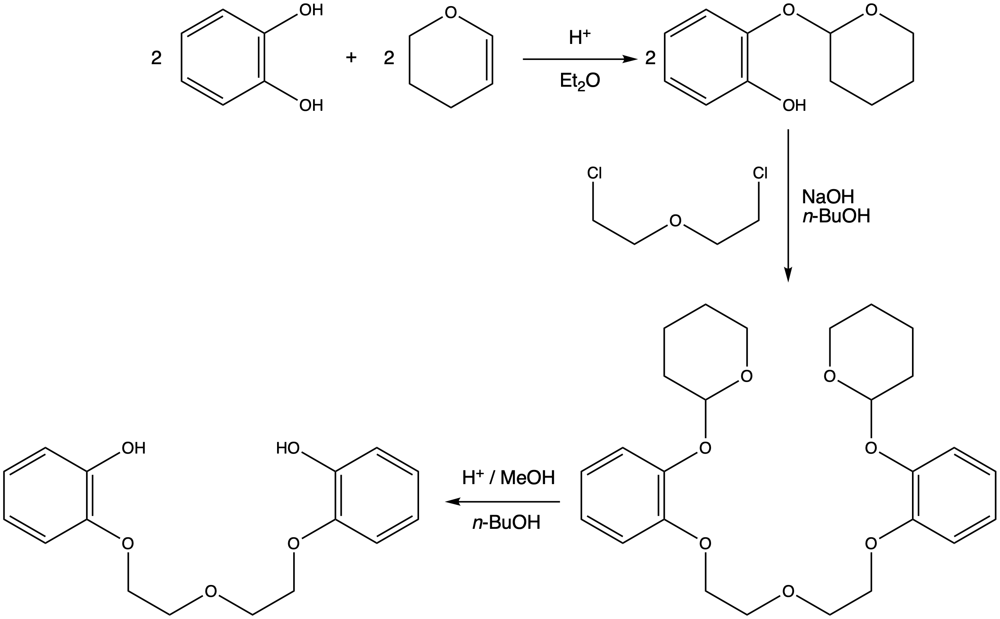

```{r setup, include=FALSE}
knitr::opts_chunk$set(echo = FALSE)
```

## Course Timetable

- Week 1: <span style="color:lightgrey">In Person - Intro to the course, refresher course on thermodynamics</span>
- Week 2: <span style="color:crimson">LOIL - Lecture - Crown & lariat ethers and related molecules</span>
- Week 3: In Person - Workshop (research paper based exercise)
- Week 4: <span style="color:darkturquoise">LOIL - Lecture - Self assembly the basics, DNA duplexing and beyond</span>
- Week 5: In Person - Workshop (research paper based exercise) 
- Week 6: <span style="color:darkturquoise">LOIL - Lecture - Tertiary structures</span>
- Week 7: In Person - Workshop (research paper based exercise)
- Week 8: <span style="color:darkturquoise">LOIL - Lecture - Binding of small molecules to biopolymers</span>
- Week 9: In Person - Workshop (research paper based exercise)
- Week 10: <span style="color:darkturquoise">LOIL - Lecture - Solvation, hydrodynamics & osmosis</span>
- Week 11: In Person - Workshop example exam questions

## Supramolecular Chemisty

*'chemistry beyond the molecule'*

- molecular systems that are held together reversibly using intermolecular interactions (*not* covalent bonds)

## Supramolecular Chemistry

- seen a lot of examples of cation binding

    -- transition metal complexes

    -- EDTA (group II metals, Fe$^{3+}$, Pb$^{2+}$, Hg$^{2+}$, Mn$^{2+}$)

    -- macrocycles (porphoryns - chlorophyll, haem)
    
    
\

Many complexing agents are not selective

## From mistakes great chemistry comes

```{r echo=FALSE, pedersensyn, out.width='80%', fig.show='hold', fig.align='center', fig.cap='The proposed mechanism for the synthesis of a copper or vanadium binding complex.'}

```
   
## From mistakes great chemistry comes

Charles J. Pedersen actually made:

\

```{r echo=FALSE, dibenzo18crown6, out.width='50%', fig.show='hold', fig.align='center', fig.cap='Dibenzo[18]crown-6.'}

```

The sodium had helped template this *new* molecule.

## Crown ethers

```{r echo=FALSE, out.width='30%', fig.show='hold', fig.align='center', fig.cap='[12]crown-4.'}

```

Crown ethers are systematically named:

- number of atoms in the macrocycle <span style="color:crimson">[X]</span>

- number of oxygens in the ring <span style="color:crimson">-y </span>

## Crown ethers


