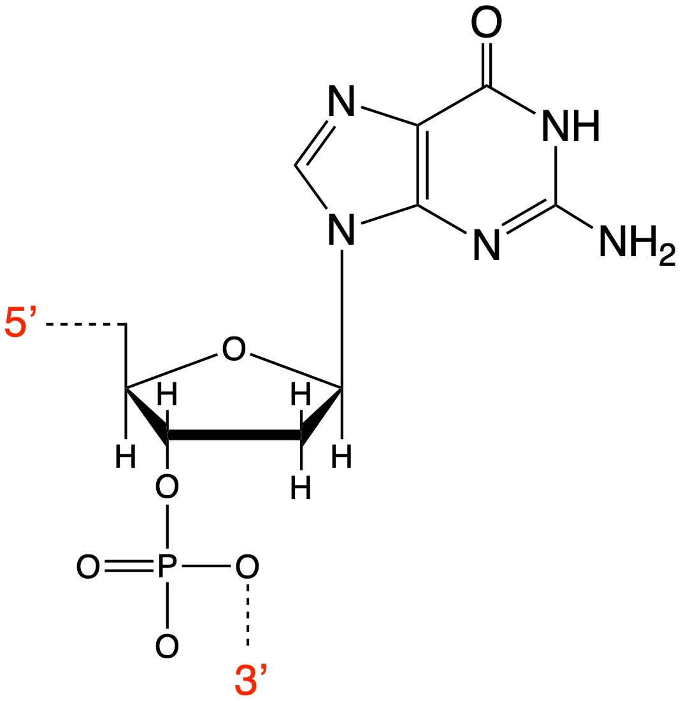

```{r setup, include=FALSE}
knitr::opts_chunk$set(echo = FALSE)
```

## Course Timetable

- Week 1: <span style="color:lightgrey">In Person - Intro to the course, refresher course on thermodynamics</span>
- Week 2: <span style="color:lightgrey">LOIL - Lecture - Crown & lariat ethers and related molecules</span>
- Week 3: <span style="color:lightgrey">In Person - Workshop (research paper based exercise)</span>
- Week 4: <span style="color:crimson">LOIL - Lecture - Self assembly the basics, DNA duplexing and beyond</span>
- Week 5: In Person - Workshop (research paper based exercise) 
- Week 6: <span style="color:darkturquoise">LOIL - Lecture - Tertiary structures</span>
- Week 7: In Person - Workshop (research paper based exercise)
- Week 8: <span style="color:darkturquoise">LOIL - Lecture - Binding of small molecules to biopolymers</span>
- Week 9: In Person - Workshop (research paper based exercise)
- Week 10: <span style="color:darkturquoise">LOIL - Lecture - Solvation, hydrodynamics & osmosis</span>
- Week 11: In Person - Workshop example exam questions

## DNA bases

DNA is (usually) composed of four different heterocyclic bases:

- the purines:

```{r echo=FALSE, purines, out.width='40%', fig.show='hold', fig.align='center', fig.cap='The purine bases of DNA: guanine (G) left and adenine (A), right.'}

```

- the pyrimidines

```{r echo=FALSE, pyrimidines, out.width='40%', fig.show='hold', fig.align='center', fig.cap='The pyrimidine bases of DNA: cytosine (C) left and thymine (T), right.'}

```

bound to a sugar  and phosphate group (R).

## Nucleotides

```{r echo=FALSE, dG, out.width='30%', fig.show='hold', fig.align='center', fig.cap='The purine base guanosine bound to the deoxyribose sugar and phosphate, the polymer is a repeat of the unit with a bond connecting the dashed lines'}

```

Polymer DNA is formed by polymerisation along the sugar phosphate backbone (phosphodiester bonds).

The DNA has 'direction' due to this asymmetry of the sugar phosphate backbone.


## GC Base Pairing

```{r echo=FALSE, GCbasepair, out.width='40%', fig.show='hold', fig.align='center', fig.cap='The base pairing between guanine and cytosine with three hydrogen bonds. Note one of the bases is flipped over, due to the two strands running antiparallel.'}

```


## AT Base Pairing

```{r echo=FALSE, ATbasepair, out.width='40%', fig.show='hold', fig.align='center', fig.cap='The base pairing between adenine and thymine with just two hydrogen bonds. Note one of the bases is flipped over, due to the two strands running antiparallel.'}

```


## DNA duplexing

```{r echo=FALSE, DNAmelt, out.width='40%', fig.show='hold', fig.align='center', fig.cap='As the temperature increases the absorbance of a sample of DNA also increaes, this is due to melting of the DNA duplex, and loss of quadrupole π interactions between the stacked base pairs.'}
knitr::include_graphics("images/DNAmelt.png")
```

We know that there is a temperature dependence of absorption when a solution of DNA is heated. 

[Forces in the DNA duplex](http://libproxy.bath.ac.uk/login?url=https://www.ncbi.nlm.nih.gov/pmc/articles/PMC7351851/)
