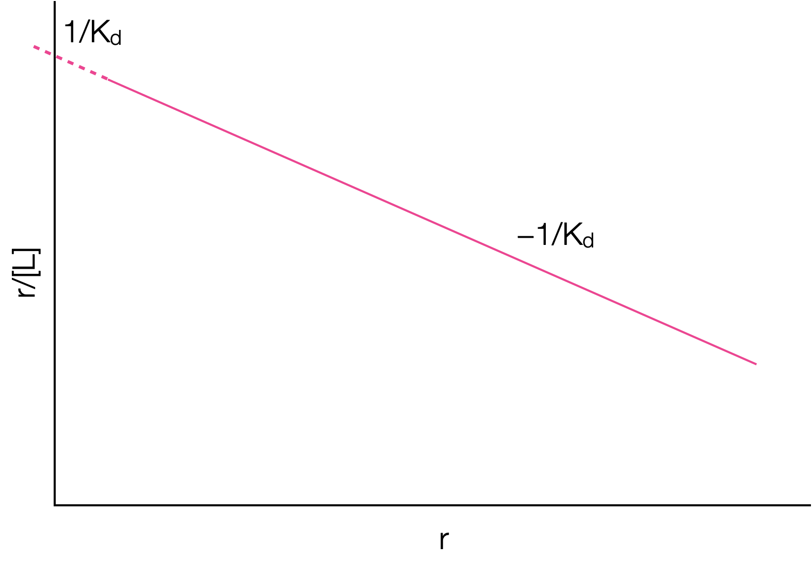

```{r setup, include=FALSE}
knitr::opts_chunk$set(echo = FALSE)
```

## Course Timetable

- Week 1: <span style="color:lightgrey">In Person - Intro to the course, refresher course on thermodynamics</span>
- Week 2: <span style="color:lightgrey">LOIL - Lecture - Crown & lariat ethers and related molecules</span>
- Week 3: <span style="color:lightgrey">In Person - Workshop (research paper based exercise)</span>
- Week 4: <span style="color:lightgrey">LOIL - Lecture - Self assembly the basics, DNA duplexing and beyond</span>
- Week 5: <span style="color:lightgrey">In Person - Workshop (research paper based exercise) </span>
- Week 6: <span style="color:crimson">LOIL - Lecture - Binding of small molecules to biopolymers</span>
- Week 7: In Person - Workshop (research paper based exercise)
- Week 8: <span style="color:darkturquoise">LOIL - Lecture - Binding of small molecules to biopolymers</span>
- Week 9: In Person - Workshop (research paper based exercise)
- Week 10: <span style="color:darkturquoise">LOIL - Lecture - Solvation, hydrodynamics & osmosis</span>
- Week 11: In Person - Workshop example exam questions

## Determining the binding constants

There are a range of methods of doing experiments and analysing data to determine the binding constants between ligand and receptor.

Fundamentally they all depend upon there being a linear change in a measurable property, this allows deptermination of the concentrations of different species in solution

## Job's method

Sometimes called the method of continuous variations

Used to look at the stoichiometry of a binding event.

Need a change in response of a physical property, P, with binding - UV/Vis absorbance , enzyme activity, conductivity, circular dichroism, melting point depression, NMR

Assumes only a single complex is formed

For the equilibrium formation of a complex RL~n~ there are only three species in solution, R, L and RL~n~

Vary the mole factions of R & L (at constant ionic strength, pH, solvent mixture *etc*)

## Job's method{.smaller}

```{r echo=FALSE, job, out.width='40%', fig.show='hold', fig.align='center', fig.cap='Sketches of a Job plots for a 1:1 complex with differeing equilibrium constant.'}
knitr::include_graphics("images/job.png")
```

The shape can be more closely analysed to determine if 1:1, 2:2, 1:2, 2:4 *etc*

[Job Plots in Oraganometallic chemistry - nice intro review article](https://www.ncbi.nlm.nih.gov/pmc/articles/PMC4028694/pdf/nihms-582800.pdf)

[Comparing Job Plots to other methods](https://www-jstage-jst-go-jp.ezproxy1.bath.ac.uk/article/analsci/19/10/19_10_1431/_pdf/-char/en)

## Thermodynamics of binding

For the equilibrium:

<p align="center">
$A+B \leftrightharpoons AB$
</p>

Then the equilibrium constant $K$ (or $K_b$) is given by:

<p align="center">
$K = \frac{[AB]}{[A][B]}$
</p>


This can also be expressed in terms of the equilibrium of dissociation of the complex:

<p align="center">
$AB \leftrightharpoons A+B$
</p>

<p align="center">
$K_d = \frac{[A][B]}{[AB]}$
</p>


## Understanding this equilibrium

This is all very nice, but we need to be able to determine values for the equilibrium constant (or at least values of the concentrations of bound or unbound form)

Unlike the Job plot we are keeping the concentration of either the ligand or the receptor constant.

Just as in Job plot other factors have to be kept constant: ionic strength, pH, solvent mixture

## Scatchard Analysis{.smaller}

If we define the number of moles of ligand, $L$, bound per mole of receptor, $R$, (regardless of state) as $r$, then:

<p align="center">
$r = \frac{[LR]}{[R]+[LR]}$
</p>

r is sometimes called the fractional occupation of binding sites.

## Fractional occupation

```{r echo=FALSE, fracocc, out.width='60%', fig.show='hold', fig.align='center', fig.cap='Sketch of how the fractional occupation of binding sites increases as the equilibrium is forced to complex with increasing ligand concentration. The most valuable data is found at low values of $[L]/K_d$'}
knitr::include_graphics("images/fracocc.png")
```

## Scatchard Analysis{.smaller}

From our equilibrium expression, $K_d=\frac{[L][R]}{[LR]}$ we can derive an expression for $[LR]$:

<p align="center">
$[LR]=\frac{[L][R]}{K_d}$
</p>
a
We can now say:

<p align="center">
$r = \frac{\frac{[L][R]}{K_d}}{[R]+\frac{[L][R]}{K_d}}$
</p>


Which rearranges to:

<p align="center">
$r = \frac{[L]}{K_d+[L]}$
</p>

Now we have an expression for the fractional occupation of binding sites with respect only to the concentration of free ligand, $L$ and the dissociation constant of binding, $K_d$.

## Scatchard Analaysis{.smaller}

This can now be rearranged to give a linear, $y=mx+c$ relationship:

<p align="center">
$\frac{r}{[L]} = \frac{1}{K_d}-\frac{r}{K_d}$
</p>

```{r echo=FALSE, singlescatchard, out.width='60%', fig.show='hold', fig.align='center', fig.cap='Sketch of a Scatchard graph for a single site receptor-ligand complex. Both the gradient and intercept can be used to determine the binding constant $K_b$, with gradient $-1/K_d$ and intercept $1/K_d$.'}

```

A graph of $r/[L]$ agains $r$ should be linear with a gradient of $-1/K_d$ (or $-K$)

The concentration of ligand used here is 'free ligand', not involved in complexing in any form.

## An aside

Why not plot $\frac{1}{r} = 1 + \frac{K_d}{[L]}$, it's equally valid...

yes but...

Data tends to clump on this plot, leading to greater uncertainties in the derived values, however...

it will depend on the data measured, so frequently both plots are checked.

## Another aside

In many enzyme studies the analysis is simplified still further by using a large excess (>100x)of 'ligand' (the enzyme would be the receptor), in essence $[L]_f = [L]_\textrm{tot}$.

In these cases 'turnover' of the enzyme is frequently used as the property changing with binding, as the ligand substrate is required for the enzyme to work.

## What happens if there is more than one binding site?

We can modifiy our fractional occupation of binding sites equation to take account of multiple binding sites, B:

<p align="center">
$r = \frac{B[L]}{K_d+B[L]}$
</p>

This assumes that the $B$ binding sites are *equivalent* and *independent*.

Therefore $K_d$ becomes an *average* binding constant.

This then rearranges to:

<p align="center">
$\frac{r}{[L]} = \frac{B}{K_d}-\frac{r}{K_d}$
</p>

*this equation is the one referred to as the Scatchard equation and is always used as if only one binding site $B=1$*

## What happens if they aren't equivalent?

