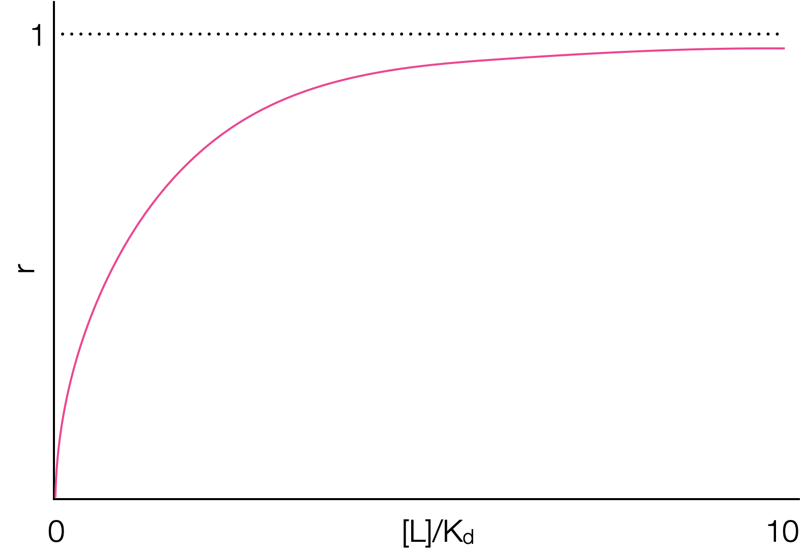

```{r setup, include=FALSE}
knitr::opts_chunk$set(echo = FALSE)
```

## Course Timetable

- Week 1: <span style="color:lightgrey">In Person - Intro to the course, refresher course on thermodynamics</span>
- Week 2: <span style="color:lightgrey">LOIL - Lecture - Crown & lariat ethers and related molecules</span>
- Week 3: <span style="color:lightgrey">In Person - Workshop (research paper based exercise)</span>
- Week 4: <span style="color:lightgrey">LOIL - Lecture - Self assembly the basics, DNA duplexing and beyond</span>
- Week 5: <span style="color:lightgrey">In Person - Workshop (research paper based exercise) </span>
- Week 6: <span style="color:crimson">LOIL - Lecture - Binding of small molecules to biopolymers</span>
- Week 7: In Person - Workshop (research paper based exercise)
- Week 8: <span style="color:darkturquoise">LOIL - Lecture - Binding of small molecules to biopolymers</span>
- Week 9: In Person - Workshop (research paper based exercise)
- Week 10: <span style="color:darkturquoise">LOIL - Lecture - Solvation, hydrodynamics & osmosis</span>
- Week 11: In Person - Workshop example exam questions

## Determining the binding constants

There are a range of methods of doing experiments and analysing data to determine the binding constants between ligand and receptor.

## Job's method

Sometimes called the method of continuous variations

Used to look at the stoichiometry of a binding event.

Need a change in response of a physical property, P, with binding - UV/Vis absorbance , enzyme activity, conductivity, circular dichroism, melting point depression, NMR

This response should be linear with concentration

Assumes only a single complex is formed

For the equilibrium formation of a complex ML~n~ there are only three species in solution, R, L and RL~n~

Vary the mole factions of R & L (at constant ionic strength, pH, solvent mixture *etc*)

## Job's method{.smaller}

```{r echo=FALSE, job, out.width='40%', fig.show='hold', fig.align='center', fig.cap='Sketches of a Job plots for a 1:1 complex with differeing equilibrium constant.'}

```

The shape can be more closely analysed to determine if 1:1, 2:2, 1:2, 2:4 *etc*

[Job Plots in Oraganometallic chemistry - nice intro review article](https://www.ncbi.nlm.nih.gov/pmc/articles/PMC4028694/pdf/nihms-582800.pdf)

[Comparing Job Plots to other methods](https://www-jstage-jst-go-jp.ezproxy1.bath.ac.uk/article/analsci/19/10/19_10_1431/_pdf/-char/en)

## Thermodynamics of binding

For the equilibrium:

<p align="center">
$A+B \leftrightharpoons AB$
</p>

Then the equilibrium constant $K$ or $K_b$ is given by:

<p align="center">
$K = \frac{[AB]}{[A][B]}$
</p>

of this can be expressed in terms of the equilibrium of dissociation of the complex:

<p align="center">
$AB \leftrightharpoons A+B$
</p>

<p align="center">
$K_d = \frac{[A][B]}{[AB]}$
</p>

## Thermodynamics of binding

We can also express this just in terms of *either* bound or unbound concentration of receptor if we know the total concentration ($[R]_{\textrm{tot}}$) of receptor in solution:

<p align="center">
$K_d = \frac{[R][L]}{[R \bullet L]} = \frac{([R]_{\textrm{tot}}-[R \bullet L])[L]}{[R \bullet L]}$
</p>

We can now express the fractional occupancy of binding sites, $F_b$ (fraction occupied divided by total number of binding sites):

<p align="center">
$F_b = \frac{[R \bullet L]}{[R]_{\textrm{tot}}}$
</p>

which rearranging we can express as:

<p align="center">
$F_b = \frac{[L]}{K_d+[L]}$
</p>

## Fractional occupation

```{r echo=FALSE, fracocc, out.width='60%', fig.show='hold', fig.align='center', fig.cap='Sketch of how the fractional occupation of binding sites increases as the equilibrium is forced to complex with increasing ligand concentration. The most valuable data is found at low values of $[L]/K_d$'}

```

## Understanding this equilibrium

This is all very nice, but we need to be able to determine values for the equilibrium constant (or at least values of the concentrations of bound or unbound form)

Unlike the Job plot we are keeping the concentration of either the ligand or the receptor constant.

Just as in Job plot other factors have to be kept constant: ionic strength, pH, solvent mixture

## Scatchard Analysis[.smaller]

If we define the number of moles of ligand, $L$, bound per mole of receptor, $R$, (regardless of state) as $r$, then:

<p align="center">
$r = \frac{[LR]}{[R]+[LR]}$
</p>

and from our equilibrim expression, $K_d=\frac{[L][R]}{[LR]}$ we can derive an expression for $[LR]$:

<p align="center">
$[LR]=\frac{[L][R]}{K_d}$
</p>

We can now say:

<p align="center">
$r = \frac{\frac{[L][R]}{K_d}}{[R]+\frac{[L][R]}{K_d}}$
</p>


Which rearranges to:

$r = \frac{[L]}{K_d+[L]}$
