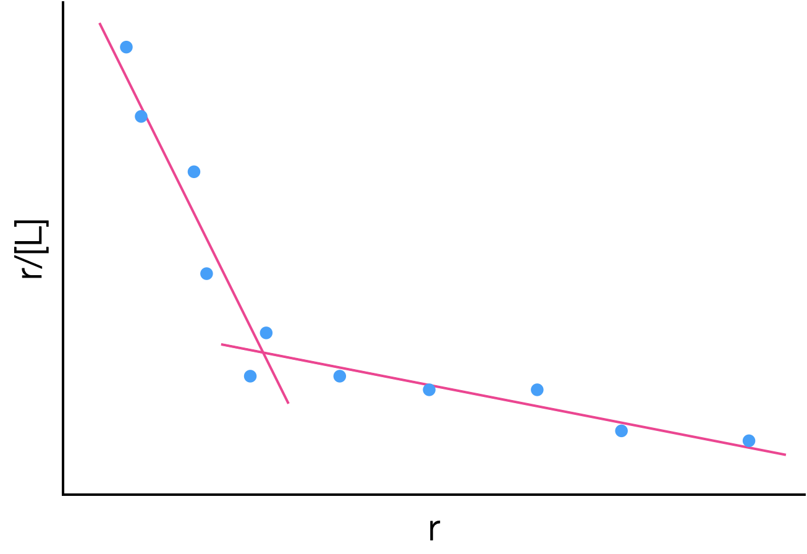
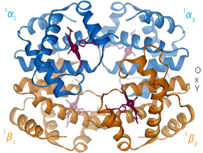
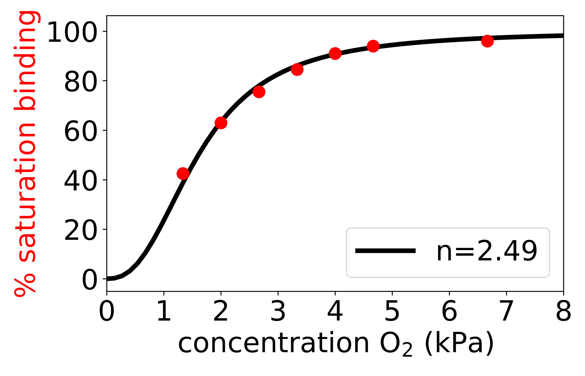
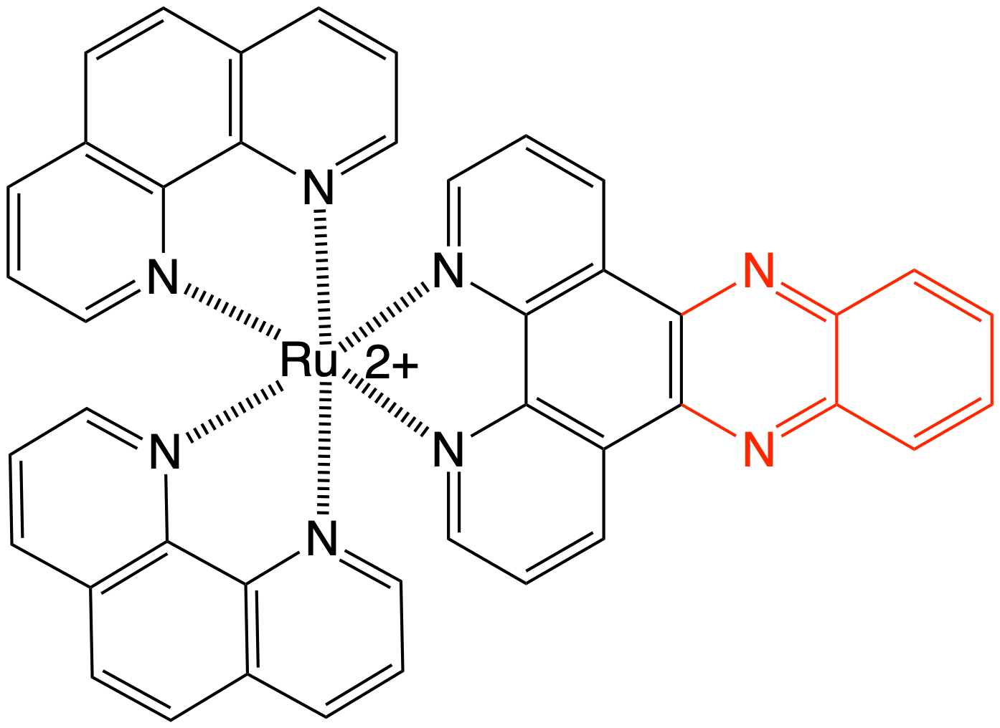
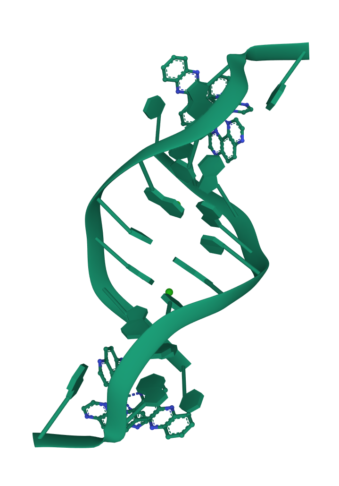
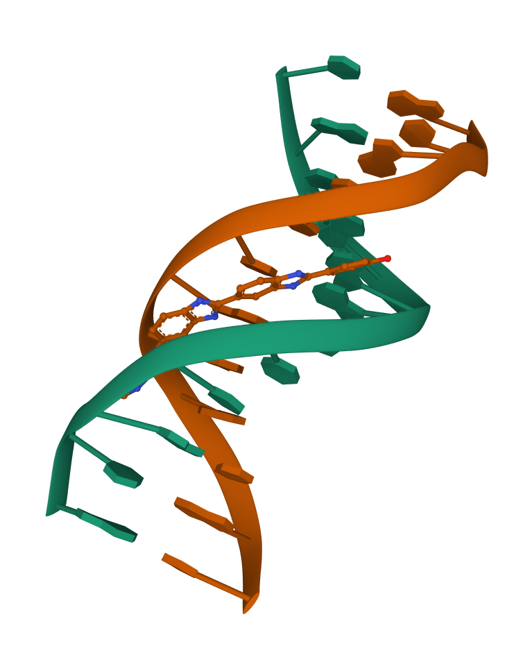

```{r setup, include=FALSE}
knitr::opts_chunk$set(echo = FALSE)
```

## Course Timetable

- Week 1: <span style="color:lightgrey">In Person - Intro to the course, refresher course on thermodynamics</span>
- Week 2: <span style="color:lightgrey">LOIL - Lecture - Crown & lariat ethers and related molecules</span>
- Week 3: <span style="color:lightgrey">In Person - Workshop (research paper based exercise)</span>
- Week 4: <span style="color:lightgrey">LOIL - Lecture - Self assembly the basics, DNA duplexing and beyond</span>
- Week 5: <span style="color:lightgrey">In Person - Workshop (research paper based exercise) </span>
- Week 6: <span style="color:crimson">LOIL - Lecture - Binding of small molecules to biopolymers</span>
- Week 7: In Person - Workshop (research paper based exercise)
- Week 8: <span style="color:darkturquoise">LOIL - Lecture - Binding of small molecules to biopolymers</span>
- Week 9: In Person - Workshop (research paper based exercise)
- Week 10: <span style="color:darkturquoise">LOIL - Lecture - Solvation, hydrodynamics & osmosis</span>
- Week 11: In Person - Workshop example exam questions

## Determining the binding constants

There are a range of methods of doing experiments and analysing data to determine the binding constants between ligand and receptor.

Fundamentally they all depend upon there being a linear change in a measurable property, this allows deptermination of the concentrations of different species in solution

## Job's method

Sometimes called the method of continuous variations

Used to look at the stoichiometry of a binding event.

Need a change in response of a physical property, P, with binding - UV/Vis absorbance , enzyme activity, conductivity, circular dichroism, melting point depression, NMR

Assumes only a single complex is formed

For the equilibrium formation of a complex RL~n~ there are only three species in solution, R, L and RL~n~

Vary the mole factions of R & L (at constant ionic strength, pH, solvent mixture *etc*)

## Job's method{.smaller}

```{r echo=FALSE, job, out.width='40%', fig.show='hold', fig.align='center', fig.cap='Sketches of a Job plots for a 1:1 complex with differeing equilibrium constant.'}
knitr::include_graphics("images/job.png")
```

The shape can be more closely analysed to determine if 1:1, 2:2, 1:2, 2:4 *etc*

[Job Plots in Oraganometallic chemistry - nice intro review article](https://www.ncbi.nlm.nih.gov/pmc/articles/PMC4028694/pdf/nihms-582800.pdf)

[Comparing Job Plots to other methods](https://www-jstage-jst-go-jp.ezproxy1.bath.ac.uk/article/analsci/19/10/19_10_1431/_pdf/-char/en)

## Thermodynamics of binding

For the equilibrium:

<p align="center">
$A+B \leftrightharpoons AB$
</p>

Then the equilibrium constant $K$ (or $K_b$) is given by:

<p align="center">
$K = \frac{[AB]}{[A][B]}$
</p>


This can also be expressed in terms of the equilibrium of dissociation of the complex:

<p align="center">
$AB \leftrightharpoons A+B$
</p>

<p align="center">
$K_d = \frac{[A][B]}{[AB]}$
</p>


## Understanding this equilibrium

This is all very nice, but we need to be able to determine values for the equilibrium constant (or at least values of the concentrations of bound or unbound form)

Unlike the Job plot we are keeping the concentration of either the ligand or the receptor constant.

Just as in Job plot other factors have to be kept constant: ionic strength, pH, solvent mixture

## Scatchard Analysis{.smaller}

If we define the number of moles of ligand, $L$, bound per mole of receptor, $R$, (regardless of state) as $r$, then:

<p align="center">
$r = \frac{[LR]}{[R]+[LR]}$
</p>

r is sometimes called the fractional occupation of binding sites.

## Fractional occupation

```{r echo=FALSE, fracocc, out.width='60%', fig.show='hold', fig.align='center', fig.cap='Sketch of how the fractional occupation of binding sites increases as the equilibrium is forced to complex with increasing ligand concentration. The most valuable data is found at low values of $[L]/K_d$'}
knitr::include_graphics("images/fracocc.png")
```

## Scatchard Analysis{.smaller}

From our equilibrium expression, $K_d=\frac{[L][R]}{[LR]}$ we can derive an expression for $[LR]$:

<p align="center">
$[LR]=\frac{[L][R]}{K_d}$
</p>
a
We can now say:

<p align="center">
$r = \frac{\frac{[L][R]}{K_d}}{[R]+\frac{[L][R]}{K_d}}$
</p>


Which rearranges to:

<p align="center">
$r = \frac{[L]}{K_d+[L]}$
</p>

Now we have an expression for the fractional occupation of binding sites with respect only to the concentration of free ligand, $L$ and the dissociation constant of binding, $K_d$.

## Scatchard Analaysis{.smaller}

This can now be rearranged to give a linear, $y=mx+c$ relationship:

<p align="center">
$\frac{r}{[L]} = \frac{1}{K_d}-\frac{r}{K_d}$
</p>

```{r echo=FALSE, singlescatchard, out.width='40%', fig.show='hold', fig.align='center', fig.cap='Sketch of a Scatchard graph for a single site receptor-ligand complex. Both the gradient and intercept can be used to determine the binding constant $K_b$, with gradient $-1/K_d$ and intercept $1/K_d$.'}
knitr::include_graphics("images/singlescatchard.png")
```

A graph of $r/[L]$ agains $r$ should be linear with a gradient of $-1/K_d$ (or $-K$)

The concentration of ligand used here is 'free ligand', not involved in complexing in any form.

## An aside

Why not plot $\frac{1}{r} = 1 + \frac{K_d}{[L]}$, it's equally valid...

yes but...

Data tends to clump on this plot, leading to greater uncertainties in the derived values, however...

it will depend on the data measured, so frequently both plots are checked.

## Another aside

In many enzyme studies the analysis is simplified still further by using a large excess (>100x)of 'ligand' (the enzyme would be the receptor), in essence $[L]_f = [L]_\textrm{tot}$.

In these cases 'turnover' of the enzyme is frequently used as the property changing with binding, as the ligand substrate is required for the enzyme to work.

## What happens if there is more than one binding site?

We can modifiy our fractional occupation of binding sites equation to take account of multiple binding sites, B:

<p align="center">
$r = \frac{B[L]}{K_d+B[L]}$
</p>

This assumes that the $B$ binding sites are *equivalent* and *independent*.

Therefore $K_d$ becomes an *average* binding constant.

This then rearranges to:

<p align="center">
$\frac{r}{[L]} = \frac{B}{K_d}-\frac{r}{K_d}$
</p>

*this equation is the one referred to as the Scatchard equation and is always used as if only one binding site $B=1$*

## What happens if they aren't equivalent?

It depends on how similar the binding constants $K_b$ are.

If 'close' probably just a get a *bad fit* on a single straight line.

If very different should see two different regions.

```{r echo=FALSE, twoscatchard, out.width='40%', fig.show='hold', fig.align='center', fig.cap='The same treatment of data can be used for data that has more than one binding mode, but the data has to be split in order to fit to more than one line.'}

```

[Binding of ligands to proteins - including more than one binding site](http://libproxy.bath.ac.uk/login?url=https://pubs.acs.org/doi/pdf/10.1021/acsomega.7b01437)

## What if binding is cooperative?

This is the case for haemoglobin. When one oxygen binds to an iron centre in the haem molecule it induces a structural change in the haem which in turn affects the structure of the protein.

```{r echo=FALSE, haem, out.width='40%', fig.show='hold', fig.align='center', fig.cap='The binding of $O_2$ to haem changes the structure of the whole protein, making it more favorble to bind further oxygen molecules.'}

```

[Haem Binding](https://commons.wikimedia.org/wiki/File:Hemoglobin_t-r_state_ani.gif) [User:BerserkerBen](https://en.wikipedia.org/wiki/User:BerserkerBen), [CC BY-SA 3.0](http://creativecommons.org/licenses/by-sa/3.0/), via Wikimedia Commons


## What if binding is cooperative?{.smaller}

Hill-Langmuir equation describes how the fractional occupation of binding sites.

<p align="center">
$r=\frac{1}{1+\left(\frac{K_b}{[L]}\right)^n}=\frac{[L]^n}{K_d+[L]^n}$*
</p>

* *just a note that althought I've said the fractional occupation is $r$ (as above) this often has other symbols including $\theta$ or $p$*

```{r echo=FALSE, hill, out.width='40%', fig.show='hold', fig.align='center', fig.cap='The Hill-Langmuir equation accurately models the binding of oxygen to haemoglobin using a model just like a Langmuir isotherm.'}

```

[Hill Plot](https://commons.wikimedia.org/wiki/File:Plot_of_%25_saturation_of_O2_binding_to_haemoglobin_as_a_function_of_O2_pressure_-_from_1910_Hill_paper.png) Richard Sear, [CC BY-SA 4.0](https://creativecommons.org/licenses/by-sa/4.0), via Wikimedia Commons

## What if binding is cooperative?

The Hill-Langmuir equation may be linearised:

<p align="center">
$\log\left(\frac{r}{1-r}\right)=n \log [L]-n\log K_b$
</p>

Here a plot of $\log\left(\frac{r}{1-r}\right)$ against $\log [L]$ will allow both the Hill coefficient $n$, and the equilibrium constant of binding $K_b$ to be determined

This $n$ coefficient describes how much cooperation there is between the binding sites.

*As with any **log-log** plot there is a large error to these values, so many data points are required*

## Some examples with DNA

There is a lot of interest in being able to *stain* DNA for various reasons, most of these dyes have fluorescent properties

A good stain will:

- be photochemically stable
- have a high binding affinity ($K_b$)
- have a high molar extinction coefficient
- have a large increase in fluorescence upon binding
- have negligable fluorescence in free solution

## Some examples of binding with DNA

Modes of binding to DNA

<div class="columns-2">
<span style="color:crimson">**External Binding**</span>

- Electrostatic
- Stacking

<span style="color:teal">**Groove Binding**</span>

- Major groove binding
- Minor groove binding

<span style="color:darkorange">**Intercalation**</span>

- monomer
- dimer
- threading
- partial

</div>

Most ligands will have more than one mode of binding, usually accessed at different mixing ratios.

## DNA binders

In the case of DNA when studying binding we normally see papers refering to either 


- the P/D ratio (phosphate to dye)

- the N/C ratio (nucleotide to chromophore)

In either case it is the number of bases of DNA per one ligand molecule (or sub part in a molecular dimer).


## DNA binders - Intercalators

<div class="columns-2">

```{r echo=FALSE, proflavin, out.width='70%', fig.show='hold', fig.align='center', fig.cap='proflavin.'}

```

```{r echo=FALSE, thionine, out.width='70%', fig.show='hold', fig.align='center', fig.cap='thionine.'}

```

```{r echo=FALSE, MB, out.width='70%', fig.show='hold', fig.align='center', fig.cap='methylene blue.'}

```


```{r echo=FALSE, ethidiumbromide, out.width='70%', fig.show='hold', fig.align='center', fig.cap='ethidium bromide.'}

```
</div>


[Phenathiazinium binding to DNA](https://onlinelibrary.wiley.com/doi/10.1002/bip.360350502)
[Ethidium bromide binding to DNA](http://libproxy.bath.ac.uk/login?url=https://www.nature.com/articles/emm200368.pdf)

## DNA binders - Intercalators - modifying the chromophore

<div class="columns-2">

```{r echo=FALSE, YOTO, out.width='60%', fig.show='hold', fig.align='center', fig.cap='x = 0, oxazole yellow x = S, thiazole orange.'}

```


```{r echo=FALSE, YOTOpro, out.width='60%', fig.show='hold', fig.align='center', fig.cap='x = 0, YO-Pro-1 x = S, TO-Pro-1.'}

```
</div>

```{r echo=FALSE, YOYOTOTO, out.width='70%', fig.show='hold', fig.align='center', fig.cap='x = 0, YOYO-1 x = S, TOTO-1.'}

```

## Semi-intercalators

A number of transition metal complexes are semi-intercalators which sometimes kink the DNA.

```{r echo=FALSE, Rucomplex, out.width='40%', fig.show='hold', fig.align='center', fig.cap='The ruthenium complexes exist in both Δ and Λ forms. [Ru(phen)$_3$]$^{2+}$ or [Ru(phen)$_2$dppz)]$^{2+}$'}

```


## Semi-intercalators

```{r echo=FALSE, Rusemi, out.width='30%', fig.show='hold', fig.align='center', fig.cap='[Ru(tap)$_2$dppz)]$^{2+}$ semi-intercalating to DNA causing a kink'}

```

[PDB Semi-intercalator](https://www.rcsb.org/3d-view/3QRN)

[Semi-intercalation of ruthenium complex leading to kink in DNA duplex](https://www.ncbi.nlm.nih.gov/pmc/articles/PMC3203786/)

## Grove binders

There are a number of grove binding dyes which share same properties...


<div class="columns-2">
```{r echo=FALSE, DAPI, out.width='80%', fig.show='hold', fig.align='center', fig.cap='DAPI'}

```

```{r echo=FALSE, distamycinA, out.width='80%', fig.show='hold', fig.align='center', fig.cap='distamycin A'}

```

```{r echo=FALSE, netropsin, out.width='80%', fig.show='hold', fig.align='center', fig.cap='netropsin'}

```

```{r echo=FALSE, hoechst33258, out.width='80%', fig.show='hold', fig.align='center', fig.cap='hoechst 33258'}

```
</div>

## Grove binders


```{r echo=FALSE, hoeschtbinding, out.width='40%', fig.show='hold', fig.align='center', fig.cap='Hoechst 33258 binding to the minor groove of DNA'}

```

[Hoechst binding to DNA](https://febs.onlinelibrary.wiley.com/doi/epdf/10.1111/j.1432-1033.1994.tb18917.x)

[PDB of Hoechst binding to DNA](https://www.rcsb.org/3d-view/264D)

## The workshop

Bring your devices...

we are going to 'do' a Scatchard analysis on some student data of ethidium bromide binding to polymer calf thymus DNA

- look at some of the difficulties in the fits
- consider errors and our values
- consider how the experiment could have been improved
